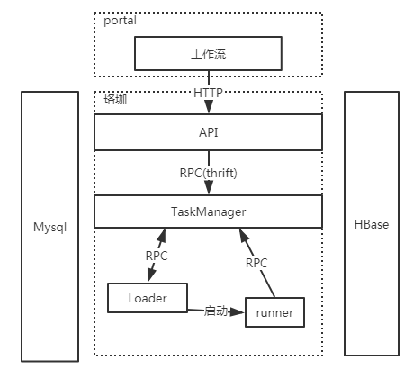

本文用来列举功能列表，描述设计思路

### 1.功能设计
##### 使用场景描述
随着大数据发展，特别是人工智能，5G 催熟大数据行业的背景下,大数据处理面临着这样的变化：  
1. 数据来源渠道多样，可能来自MySQL，sql server,orcle，日志文件，或者kafka等  
2. 数据处理方式多样，可能需要java处理，可能需要MR,SPARK,HIVE SQL,Flink  
3. 需要支持多平台，可能来自不同的hadoop 集群，或者CDH,Ambari集群等    
4. 业务多样，除了数据计算，数据处理，还有MPI，机器学习

上面的这些变化，让数据的处理越发复杂，一个业务可能需要多个任务配合，多一个业务之间有任务被共用。可能一个业务有实时处理，有离线处理，有批量处理等等。而且一个业务涉及的处理不是一次性的，是需要随着时间迁移周期性的执行。  

所以有数据处理诉求业务的公司通常都会有 涉及不同业务处理单元的调度系统。

##### 核心诉求
尽管目前开源的调度系统有 airflow，oozie,azkaban 等，但还是有一些不如意的地方，比如想有一个纯java的开源调度系统，而且能够支持百万级的任务，千万级的任务实例。更清晰的架构，更灵活的页面渲染样式等等。  

**系统核心诉求**  
1. 纯java项目  
2. 系统结构更加合理（倾向靠近yarn 模块设计）  
3. 页面渲染和任务调度处理分离  
4. 对外提供操作API，用户体验页面方便升级  
5. 调度和任务分离，支持多种任务配置，支持离线，实时，批量。支持一次性，周期性任务。支持自定义任务  
6. 支持百万级别任务，千万级别任务实例  
7. 查看日志方便  
8. 任务配置支持多版本  
9. 有系统配置后台  
10. 能够查询任务血缘  

### 2. 设计思路
##### 2.1 系统结构

系统模块结构（初步）  
  

系统核心包括API，TaskManager,Loader,Runner。数据存储Mysql ，为了支持千万级以上的任务实例，任务实例数据放HBase

##### 2.2 模块概要
**API**  
api 对外提供操作接口，后期需要加一个AdminService 用来提供后台管理接口，API 直接mysql以及通过RPC访问TaskManager  

**TaskManger**  
主要负责任务调度，期望类似yarn 中央调度器和状态机来处理任务和任务实例的状态转移。 

**loader**  
loader 类似yarn 的nodemanger ，通过心跳维持跟TaskManager 的连接，通过pull的方式来请求需要执行的任务实例  

**runner**  
具体执行的任务实例是一个具体的进程（Runner），也可以是docker 

 

 